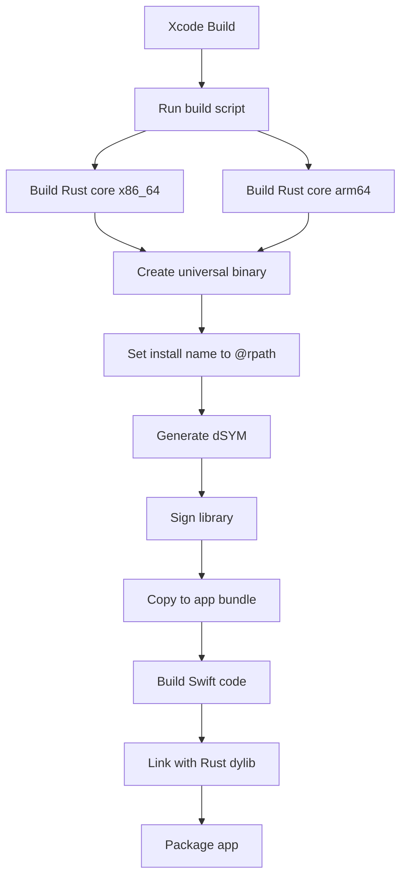

# Architecture - My Search Buddy

## Monorepo Structure

This repository uses a **monorepo architecture** to share the Rust search core between macOS and iOS applications.

```
my-search-buddy/
├── core/                          # Shared Rust core
│   └── finder-core/               # Search engine library
│       ├── src/                   # Rust source code
│       ├── include/               # C FFI headers
│       ├── Cargo.toml
│       └── cbindgen.toml
│
├── macos/                         # macOS application
│   ├── MySearchBuddy.xcodeproj
│   ├── MySearchBuddy/             # SwiftUI app code
│   ├── Packages/
│   │   └── FinderCoreFFI/         # Swift wrapper for Rust core
│   │       └── Sources/
│   │           ├── FinderCoreFFI/ # Swift interface
│   │           └── FinderCoreShims/ # C bridging layer
│   ├── Resources/
│   └── README_Xcode.md
│
├── ios/                           # iOS application (coming soon)
│   ├── README.md                  # iOS roadmap and plans
│   └── (Future iOS app structure)
│
├── scripts/                       # Build automation
│   └── build_finder_core_universal.sh  # Builds universal binary for macOS
│
├── ci_scripts/                    # Xcode Cloud CI/CD
│   ├── ci_post_clone.sh          # Install Rust toolchain
│   └── ci_pre_xcodebuild.sh      # Build Rust before Xcode
│
├── docs/                          # Documentation
├── Cargo.toml                     # Rust workspace configuration
├── README.md                      # Main documentation
└── CHANGELOG-APP-STORE-FIX.md    # Recent fixes and changes
```

## Component Responsibilities

### 1. Core (`core/finder-core/`)

**Language:** Rust
**Purpose:** Shared search engine used by both macOS and iOS

**Responsibilities:**
- File system scanning and indexing
- Full-text search using Tantivy
- Metadata extraction
- Content sampling and analysis
- Query processing and ranking

**Build outputs:**
- `libfinder_core.dylib` - Dynamic library for macOS (universal binary)
- `libfinder_core.a` - Static library for iOS (future)
- `finder_core.h` - C FFI header for Swift bridge

### 2. macOS App (`macos/`)

**Language:** Swift/SwiftUI
**Platform:** macOS 13.0+

**Responsibilities:**
- User interface and UX
- File system permissions management
- Security-scoped bookmarks
- Quick Look integration
- App Store subscription management
- Settings and preferences

**Key components:**
- `MySearchBuddy/` - Main app code
- `Packages/FinderCoreFFI/` - Swift wrapper around Rust core
  - `FinderCoreShims` - C header bridging layer
  - `FinderCoreFFI` - Swift-friendly API

### 3. iOS App (`ios/`) - Coming Soon

**Language:** Swift/SwiftUI
**Platform:** iOS 16.0+

**Planned responsibilities:**
- Cross-cloud file search (iCloud, Dropbox, Google Drive, OneDrive)
- Files app integration
- Cloud provider API integration
- Siri shortcuts and widgets
- Share extension

## Build Process

### macOS Build Flow



**Steps:**
1. Xcode runs `scripts/build_finder_core_universal.sh`
2. Script builds Rust for both architectures
3. Creates universal binary with `lipo`
4. Sets library install name to `@rpath/libfinder_core.dylib`
5. Generates dSYM for crash reporting
6. Signs the library (if code signing enabled)
7. Copies to `target/release/`
8. Xcode links Swift code against the dylib
9. Embeds library in app bundle at `MySearchBuddy.app/Contents/Frameworks/`

### iOS Build Flow (Future)

```
1. Build Rust for iOS architectures (arm64, arm64-simulator)
2. Create XCFramework or static library
3. Xcode links Swift code
4. Package app with embedded framework
```

## FFI Bridge Architecture

### Layer 1: Rust Core (C ABI)

```rust
// finder-core/src/lib.rs
#[no_mangle]
pub extern "C" fn finder_search(query: *const c_char) -> *mut SearchResults {
    // Implementation
}
```

### Layer 2: C Header (Generated by cbindgen)

```c
// core/finder-core/include/finder_core.h
void* finder_search(const char* query);
```

### Layer 3: C Shims (Bridge to Swift)

```c
// macos/Packages/FinderCoreFFI/Sources/FinderCoreShims/include/finder_core_shim.h
#include "../../../../../../core/finder-core/include/finder_core.h"
```

### Layer 4: Swift Wrapper

```swift
// macos/Packages/FinderCoreFFI/Sources/FinderCoreFFI/FinderCore.swift
import FinderCoreShims

public class FinderCore {
    public func search(query: String) -> [SearchResult] {
        // Call C FFI, convert results to Swift types
    }
}
```

## Shared Code Strategy

### Currently Shared
- ✅ Rust search core (`core/finder-core/`)
- ✅ C FFI interface
- ✅ Build scripts (with platform detection)

### Platform-Specific
- macOS: Full file system access, Finder integration
- iOS: Cloud provider APIs, Files app integration

### Future Shared Components
- Search algorithm logic
- Indexing strategies
- Content extraction utilities
- Common SwiftUI views (search results, file badges)

## Development Workflow

### Working on macOS App

```bash
# Build Rust core
bash scripts/build_finder_core_universal.sh

# Open Xcode project
cd macos
open MySearchBuddy.xcodeproj

# Or build from command line
xcodebuild -project MySearchBuddy.xcodeproj -scheme MySearchBuddy -configuration Release
```

### Working on Rust Core

```bash
# Run tests
cargo test -p finder-core

# Build for development
cargo build -p finder-core

# Build for release
cargo build -p finder-core --release
```

### Preparing for iOS Development

```bash
# Install iOS targets
rustup target add aarch64-apple-ios
rustup target add aarch64-apple-ios-sim

# Create iOS build script (future)
# scripts/build_finder_core_ios.sh
```

## Why Monorepo?

### Advantages
1. **Single source of truth** - One repo, one version, one set of issues
2. **Atomic changes** - Update Rust core and both apps in one commit
3. **Shared CI/CD** - One build pipeline for all platforms
4. **Easier testing** - Changes can be tested across platforms immediately
5. **Simplified dependencies** - One `Cargo.lock`, one `Cargo.toml`

### Trade-offs
- Larger repo size
- Need clear directory separation
- Platform-specific builds must not interfere

## Platform-Specific Considerations

### macOS
- **Universal binary required** (Intel + Apple Silicon)
- **Sandboxing:** App sandbox enabled, user script sandboxing disabled (for build scripts)
- **Code signing:** Required for App Store distribution
- **Entitlements:** File access, user-selected files
- **dSYM required:** For crash reporting to App Store

### iOS (Future)
- **Static library preferred** (easier App Store submission)
- **Bitcode:** May be required depending on App Store policy
- **Background processing:** Limited for indexing
- **Cloud provider SDKs:** Required for cross-cloud search
- **Files app provider:** Integration for seamless access

## Testing Strategy

### Rust Core Tests
```bash
cargo test -p finder-core
```

### Swift FFI Tests (macOS)
```bash
cd macos/Packages/FinderCoreFFI
swift test
```

### Integration Tests
- Manual testing of search functionality
- Quick Look preview testing
- File system permission testing
- Cloud file detection testing

## Deployment

### macOS App Store
1. Archive app in Xcode
2. Upload to App Store Connect
3. Submit for review
4. Version: Managed in Xcode build settings

### iOS App Store (Future)
1. Archive iOS app
2. Upload to App Store Connect
3. Submit for review

## Version Management

- **Rust core:** Version in `core/finder-core/Cargo.toml`
- **macOS app:** Marketing version and build number in Xcode project settings
- **iOS app (future):** Separate versioning from macOS

## Resources

- [Swift/Rust FFI Guide](https://mozilla.github.io/uniffi-rs/)
- [cbindgen Documentation](https://github.com/eqrion/cbindgen)
- [Tantivy Search Engine](https://github.com/quickwit-oss/tantivy)
